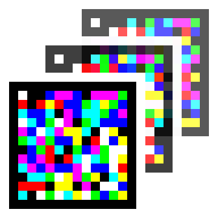
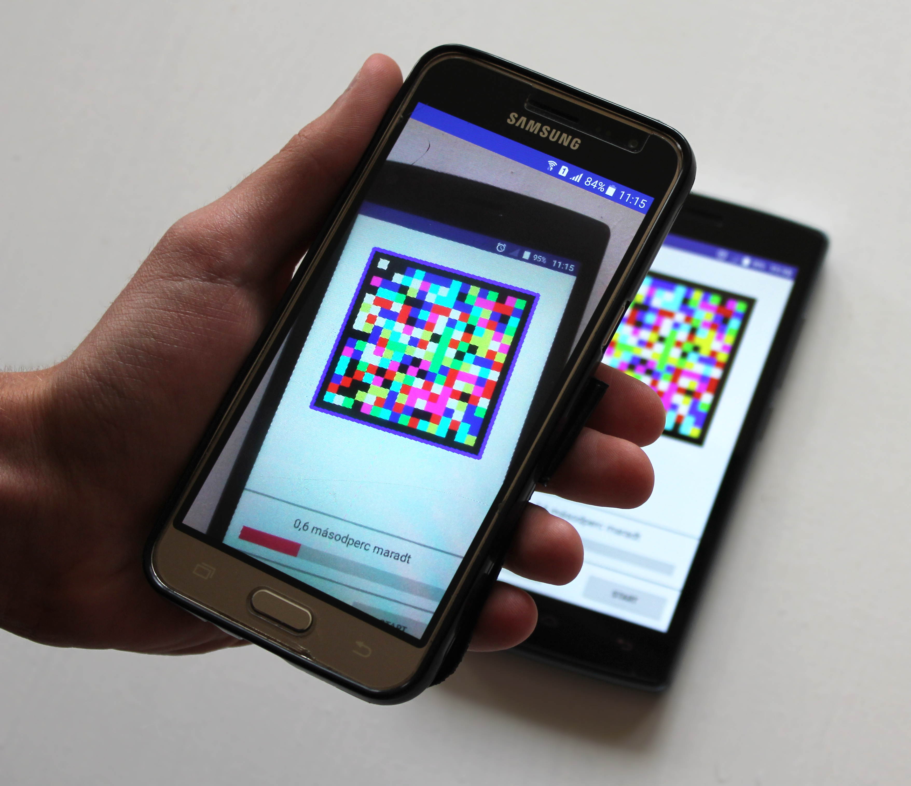

# Cell Matrix Colored Movie (CMCM)

A two-dimensional, colored barcode data stream.
Similarly to the widely known technologies such as QR-code, the goal of CMCM is also to transfer small amounts of data to electrical devices.
There are two main differences though: CMCM also uses colors, it is not just black and white, and the data is not stored on a single image, but rather on a sequence of images.
The transmitting device can show ~15 unique frames a second, each holding a portion of the total data payload.
Thanks to these properties information can be transmitted using a much lower resolution camera or display.

All of this comes at a price though: these barcodes cannot be printed; they must be transmitted from an electrical display.
So CMCM aims to offer higher data throughput than its printable alternatives in situations where printing isn't necessary.
The barcodes use 8 unique colors, multiplying the amount of data they can hold at the same resolution by three (compared to black and white alternatives).
The maximum payload size is also much higher since multiple frames are used to store data, not just a single one.
This also means that one can opt to use more frames at the same resolution to transmit more data, only at the price of increasing transmission time.
When it comes to printed alternatives, such choices cannot be made, the only solution is to increase the barcode resolution.

Some technologies exist that aim to use multiple colors on printed barcodes.
The problem with these attempts is that illumination greatly affects how colors are perceived by cameras.
Colored lights (or just colored walls), incorrect white balancing in cameras can all cause issues during decodes of printed barcodes.
CMCM luckily does not suffer from this, as its barcodes don't get printed, they only exist on electrical displays.

This technology aims to offer a more secure, more private alternative to WiFi and Bluetooth.
The transmission of data using CMCM requires physical presence and a line of sight, unlike when using the mentioned alternatives.
As the communication is only one way (the display transmits data to the camera, the camera can't send anything back),
the transmission leaves no traces (unlike internet packets) and doesn't compromise the transmitting party.

Another potential use case is in the public transport sector.
As e-tickets are rising, there might be a need to transmit more data than just an identifier and expiry date.
Should traditional barcodes not be able to hold this increased data size, this system offers an alternative.

More in-depth descriptions can be found [here](https://drive.google.com/drive/folders/12DbdfSJW3uteZiVrxa9BRqsjr3mY6vBR)

